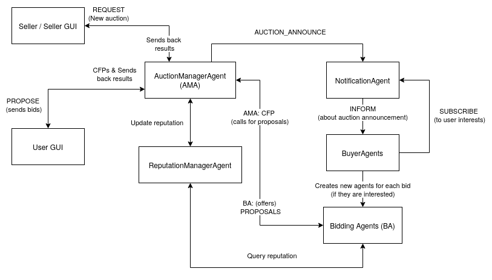

# Book Bazaar: A JADE Multi-Agent Auction System

[](https://jade.tilab.com/) [](https://www.oracle.com/java/) [](LICENSE)

> **Book Bazaar** is a smart, user-friendly **multi-agent system** for auctioning books. Sellers publish book auctions, buyers subscribe to genres/authors, and autonomous bidding agents compete using customizable strategies. It supports both **English** and **Dutch** auction formats (**BLIND** WIP), with real-time GUIs for creating and participating in auctions.

---

## Features

- **Book-specific auctions**: Title, Author, Genre, Starting Price, and Minimum Reputation.  
- **Interest-based notifications**: Buyers subscribe to genres/authors and only receive relevant auction announcements.  
- **Autonomous bidding**: Agents employ strategies—One-Shot, Periodic, Always-First, Cautious—to place bids automatically.  
- **Auction types**:
  - **English**: price increases in discrete rounds  
  - **Dutch**: price decreases until someone accepts  
  - **Blind**: sealed bids within a fixed window  
- **Reputation system**: Tracks joined, won, early-exit events to filter participation by seller-defined minimum score.  
- **Swing GUIs**:
  - **Auction Creator**: sellers launch new auctions.  
  - **Bidder Interface**: humans can monitor & bid (or accept) live auctions.  
- **Queuing & concurrency**: Only one auction runs at a time; pending auctions are queued.

---

## Architecture



- **BootAgent**: Spins up all agents (main container).  
- **SellerAgent**: Publishes initial auctions.  
- **NotificationAgent**: Routes `AUCTION_ANNOUNCE` to interested buyers.  
- **BuyerAgent**: Filters auctions by interest & reputation, spawns BiddingAgent.  
- **BiddingAgent**: Executes one buyer’s participation in a single auction.  
- **AuctionManagerAgent**: Core logic—runs auctions, handles CFP/PROPOSE, closes auctions, notifies GUIs.  
- **ReputationManagerAgent**: Maintains buyer scores (0–5) from join/win/exit events.  
- **AuctionGuiAgent**: Swing GUI to create new auctions.  
- **AuctionBidGuiAgent**: Swing GUI for human bidding/accepting.

---


## Known issues/Planned improvements

- [x] **FIX** sync issue causing irregular start of agents  
  - Was Actually just a desync of seller being initialized before the buyers; add a slight delay to finish the setup fixes the issue  
- [ ] **FIX** not being able to win a BLIND auction + non-updating of GUI  
- [ ] **IMPROVEMENT:** Author/genre matching non-case sensitive + support abbreviations (e.g. “Sci-Fi” == “Science Fiction”)  
- [ ] **TO DO:** “Add money” button for the user to be able to play around more  
- [ ] **QOL:** Bidder names not colored everywhere — would be nice for them to be :)  
- [ ] **IDEA:** Add emojis or something similar in the CLI to highlight events better  
- [ ] **QOL:** Round doubles to 2 decimal places in the GUIs to avoid long ugly numbers  

---

## Requirements

### Prerequisites

- Java 11+  
- [JADE 4.x](https://github.com/jade-project/jade) runtime (is included in the repo)
- Maven or Gradle (for dependency management)

### Installation

```bash
# Clone the repo
git clone https://github.com/yourusername/book-bazaar-jade.git
cd book-bazaar-jade

# Build with Maven
mvn clean package
```
